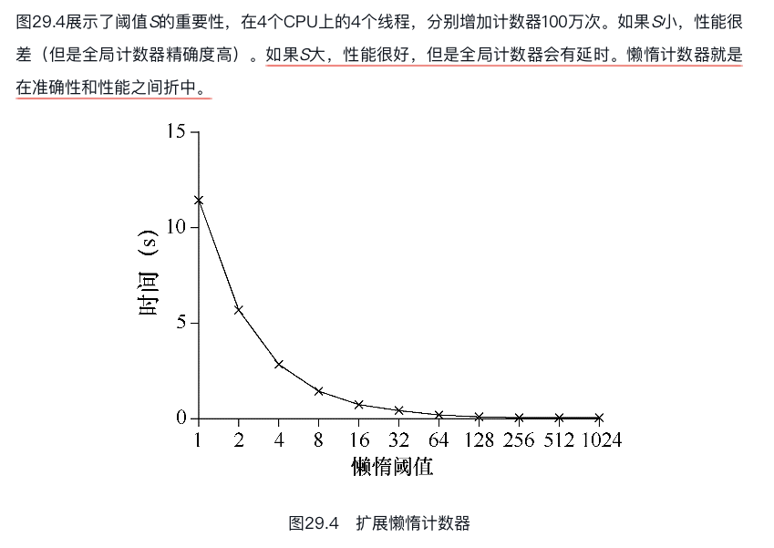
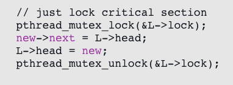

# 基于锁的并发数据结构
通过锁可以使数据结构线程安全（thread safe）。当然，具体如何加锁决定了该数据结构的正确性和效率？

## 关键问题：如何给数据结构加锁？

对于特定数据结构，如何加锁才能让该结构功能正确？进一步，如何对该数据结构加锁，能够保证高性能，让许多线程同时访问该结构，即并发访问（concurrently）？

这里涉及的其实就是线程安全的数据结构,它们都可以被安全的访问,每次访问都可以看成一组事物.

## 并发计数器

```C
1    typedef struct  counter_t {
2        int            value;
3        pthread_mutex_t lock;
4    } counter_t;
5
6    void init(counter_t *c) {
7        c->value = 0;
8        Pthread_mutex_init(&c->lock,  NULL);
9    }
10
11   void increment(counter_t *c) {
12       Pthread_mutex_lock(&c->lock);
13       c->value++;
14       Pthread_mutex_unlock(&c->lock);
15   }
16
17   void decrement(counter_t *c) {
18       Pthread_mutex_lock(&c->lock);
19       c->value--;
20       Pthread_mutex_unlock(&c->lock);
21   }
22
23   int get(counter_t *c) {
24       Pthread_mutex_lock(&c->lock);
25       int rc = c->value;
26       Pthread_mutex_unlock(&c->lock);
27       return rc;
28   }
```
这个简单的计数器很简单,但是有性能问题.

线程越多,性能越差,这是因为获取锁和释放锁开销很大.

理想情况下，你会看到多处理上运行的多线程就像单线程一样快。达到这种状态称为完美扩展（perfect scaling）。虽然总工作量增多，但是并行执行后，完成任务的时间并没有增加。

因此说一个程序扩展性差,是说它与完美拓展差距很大,达不到拓展的预期.

## 可拓展的计数器

令人吃惊的是，关于如何实现可扩展的计数器，研究人员已经研究了多年。更令人吃惊的是，最近的操作系统性能分析研究表明，可扩展的计数器很重要。没有可扩展的计数，一些运行在Linux上的工作在多核机器上将遇到严重的扩展性问题。

懒惰计数器通过多个局部计数器和一个全局计数器来实现一个逻辑计数器，其中每个CPU核心有一个局部计数器。具体来说，在4个CPU的机器上，有4个局部计数器和1个全局计数器。除了这些计数器，还有锁：每个局部计数器有一个锁，全局计数器有一个。

局部值会定期转移给全局计数器，方法是获取全局锁，让全局计数器加上局部计数器的值，然后将局部计数器置零.

是阈值S为1024时懒惰计数器的性能。性能很高，4个处理器更新400万次的时间和一个处理器更新100万次的几乎一样。



完善后的懒惰计数器就如`lazy_counter.c`一样,它通过开辟 4 个线程,每个线程单独执行,然后各个线程计数,触发条件之后,将自己的报数合并到总的计数上.

这里的关键是,如果 CPU 的个数少于 4 个,性能可能就开始下降了.因为这意味着这至少有一个线程将会进入竟态.而另一个计数器在做一次运算之后,可能会丢失计数器,这样就又会把时间浪费在切换上下文上了.

## 并发链表

接下来看一个更复杂的数据结构，链表。同样，我们从一个基础实现开始。简单起见，我们只关注链表的插入操作.

在文件`list.c`中实现了一个 4 线程的线程安全的链表.

从代码中可以看出，代码插入函数入口处获取锁，结束时释放锁。如果malloc失败（在极少的时候），会有一点小问题，在这种情况下，代码在插入失败之前，必须释放锁。

事实表明，这种异常控制流容易产生错误。最近一个Linux内核补丁的研究表明，有40%都是这种很少发生的代码路径（实际上，这个发现启发了我们自己的一些研究，我们从Linux文件系统中移除了所有内存失败的路径，得到了更健壮的系统[S+11]）。

所以这种严苛的编程习惯增强了整个系统的健壮性.

事实上,我们也没有必要让这把锁将那么大的临界区锁起来,我们可以只把这个锁放在几行关键的地方,让队列的插入变成一个逻辑上的原子操作即可.


## 拓展链表

尽管我们有了基本的并发链表，但又遇到了这个链表扩展性不好的问题。研究人员发现的增加链表并发的技术中，有一种叫作过手锁（hand-over-hand locking，也叫作锁耦合，lock coupling.

原理也很简单。每个节点都有一个锁，替代之前整个链表一个锁。遍历链表的时候，首先抢占下一个节点的锁，然后释放当前节点的锁。

从概念上说，过手锁链表有点道理，它增加了链表操作的并发程度。

但是实际上，在遍历的时候，每个节点获取锁、释放锁的开销巨大，很难比单锁的方法快。

即使有大量的线程和很大的链表，这种并发的方案也不一定会比单锁的方案快。也许某种杂合的方案（一定数量的节点用一个锁）值得去研究。

### 提示：更多并发不一定更快

如果方案带来了大量的开销（例如，频繁地获取锁、释放锁），那么高并发就没有什么意义。如果简单的方案很少用到高开销的调用，通常会很有效。增加更多的锁和复杂性可能会适得其反。话虽如此，有一种办法可以获得真知：实现两种方案（简单但少一点并发，复杂但多一点并发），测试它们的表现。毕竟，你不能在性能上作弊。结果要么更快，要么不快。

## 并发队列

总有一个标准的方法来创建一个并发数据结构：添加一把大锁。对于一个队列，我们将跳过这种方法，假定你能弄明白。

以下这个例子,将会展示另一种实现并发队列的方法.


